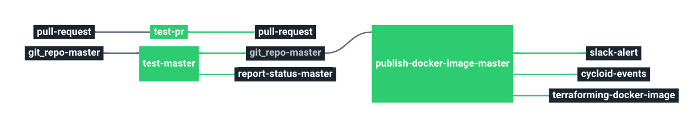

# Stack-golang

Service catalog for Golang stack.

This stack will create a pipeline to test golang projects.

# Requirements

No requirements

# Details

## Pipeline

**Jobs description**

  * `test-pr`: Pipeline task that will run tests on every pull request.
  * `test-master`: Pipeline job similar to the test-pr one, but it will run the test in the defined branch. It is usually the production branch.

**Params**

|Name|Description|Type|Default|Required|
|---|---|:---:|:---:|:---:|
|`env`|Name of the project's environment.|`-`|`($ environment $)`|`True`|
|`customer`|Name of the Cycloid Organization, used as customer variable name.|`-`|`($ organization_canonical $)`|`True`|
|`project`|Name of the project.|`-`|`($ project $)`|`True`|
|`ci-context`|A context to use for the status.|`-`|`golang-test`|`True`|
|`github-repo-uri`|Git repository url.|`-`|`git@github.com:cycloidio/terraforming.git`|`True`|
|`github-repo-name:`|Name of the git repository.|`-`|`cycloidio/terraforming`|`True`|
|`github-access-token`|Github token used for commits and pr notifications.|`-`|`($ github_access_token.data $)`|`True`|
|`github-private-key`|SSH key pair to fetch the config git repository.|`-`|`((git_config_ro.ssh_key))`|`True`|
|`docker-image`|Golang docker image.|`-`|`golang`|`True`|
|`docker-image-tag`|Golang docker image tag.|`-`|`1.12`|`True`|
|`branch`|Branch of the git repository.|`-`|`master`|`True`|
|`go-path-cache`|Go dependencies cache path.|`-`|`go/pkg/mod`|`True`|
|`script`|Script that will trigger the tests.|`-`|`go test ./...`|`True`|